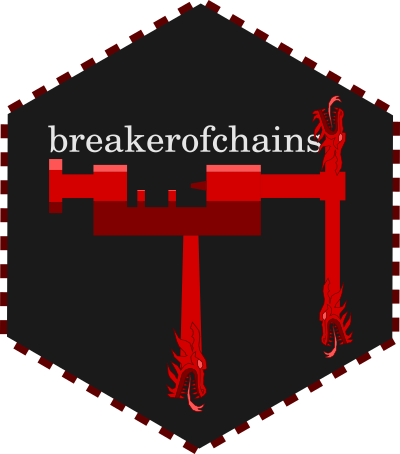

<!-- README.md is generated from README.Rmd. Please edit that file -->

# breakerofchains 

<!-- badges: start -->

<!-- badges: end -->

Break your chain at the cursor line. Run the first bit. See the output.
Be free.

## Installation

``` r
# install.packages("remotes")
remotes::install_github("MilesMcBain/breakerofchains")
```

## Usage

Say you had:

``` r
library(tidyverse)

star_plot <-
  starwars %>%
  group_by(species, sex) %>%
  select(height, mass) %>%
  summarise(
    height = mean(height, na.rm = TRUE),
    mass = mean(mass, na.rm = TRUE)
  ) %>%
  ggplot(aes(x = height, y = mass)) +
  geom_point()
```

1.  Pop your cursor on line you want to run up to. e.g. `select(height,
    mass)`.

2.  Invoke the RStudio Addin `Break chain and run to cursor`

3.  Code is run from start of chain up to your cursor line, and result
    is printed in the console:

<!-- end list -->

``` r
starwars %>%
  group_by(species, sex) %>%
  select(height, mass)
#> Adding missing grouping variables: `species`, `sex`
#> # A tibble: 87 x 4
#> # Groups:   species, sex [41]
#>    species sex    height  mass
#>    <chr>   <chr>   <int> <dbl>
#>  1 Human   male      172    77
#>  2 Droid   none      167    75
#>  3 Droid   none       96    32
#>  4 Human   male      202   136
#>  5 Human   female    150    49
#>  6 Human   male      178   120
#>  7 Human   female    165    75
#>  8 Droid   none       97    32
#>  9 Human   male      183    84
#> 10 Human   male      182    77
#> # … with 77 more rows
```

with a stored result available in `.chain`:

``` r
glimpse(.chain)
#> Rows: 87
#> Columns: 4
#> Groups: species, sex [41]
#> $ species <chr> "Human", "Droid", "Droid", "Human", "Human", "Human", "Human",…
#> $ sex     <chr> "male", "none", "none", "male", "female", "male", "female", "n…
#> $ height  <int> 172, 167, 96, 202, 150, 178, 165, 97, 183, 182, 188, 180, 228,…
#> $ mass    <dbl> 77.0, 75.0, 32.0, 136.0, 49.0, 120.0, 75.0, 32.0, 84.0, 77.0, …
```

It’ll work with more than `%>%`. Chains can be broken at lines ending in
any `%%` infix, and any math/logic infix. So you can break `ggplot2`
layers chained with `+` this way too.

## Stored result `.chain`

By default the result of the last broken chain is saved in your
environment as the variable `.chain` so you can immediately start
passing it to further diagnostics. I’ve found this is nicer than
`.Last.value` which is easy to accidently overwrite, and has a hard to
remember the capitalisation scheme.

Disable this behaviour with `options(breakerofchains_store_result =
FALSE)`

## Keybindings

  - RStudio: [addins can be bound to keys using the keybinding
    menu](https://www.infoworld.com/article/3327573/do-more-with-r-rstudio-addins-and-keyboard-shortcuts.html).
  - VSCode: create a binding for your `keybindings.json` like:

<!-- end list -->

``` json
[
    {
        "description": "run breakerofchains",
        "key": "ctrl+shift+b",
        "command": "r.runCommand",
        "when": "editorTextFocus",
        "args": "breakerofchains::break_chain()"
    },
]
```

## Pitfalls

Since R’s parser is used to help figure out where the chain starts, the
process will fail if any of the code above the cursor is invalid - even
code not in the chain.

For Rmd documents only code in the current chunk is parsed.
